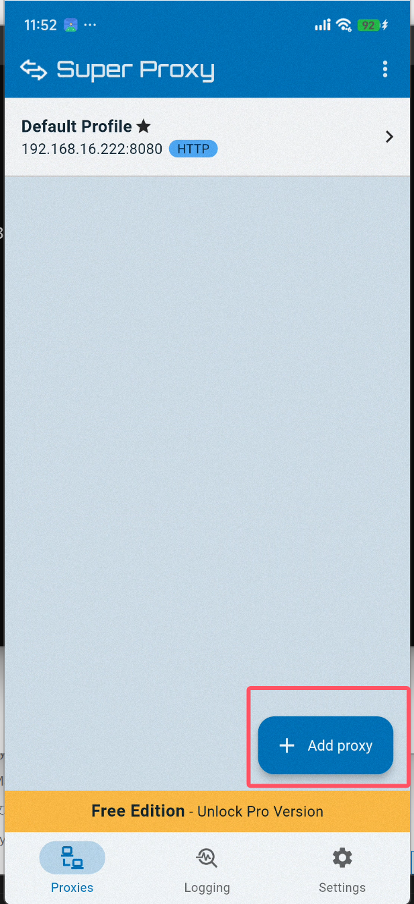
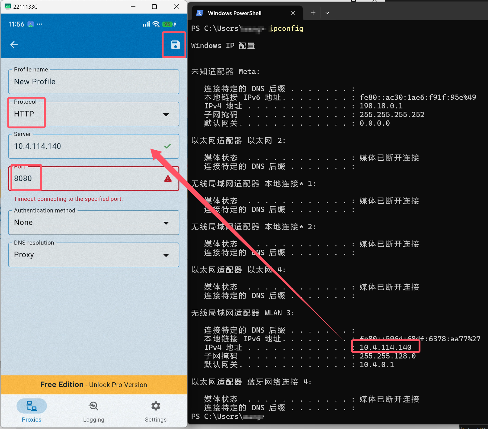
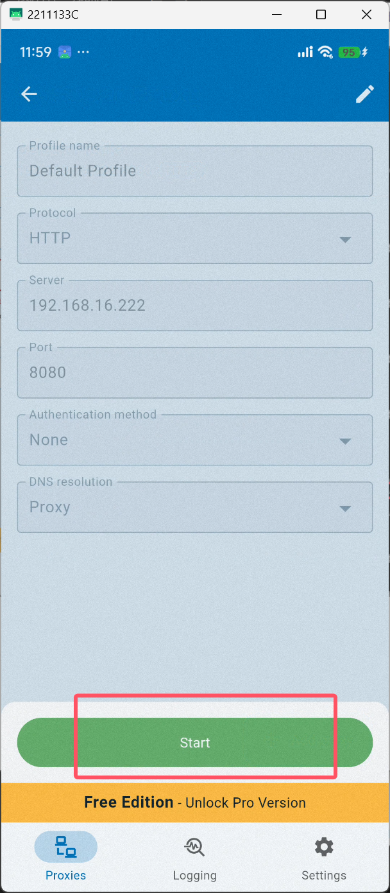
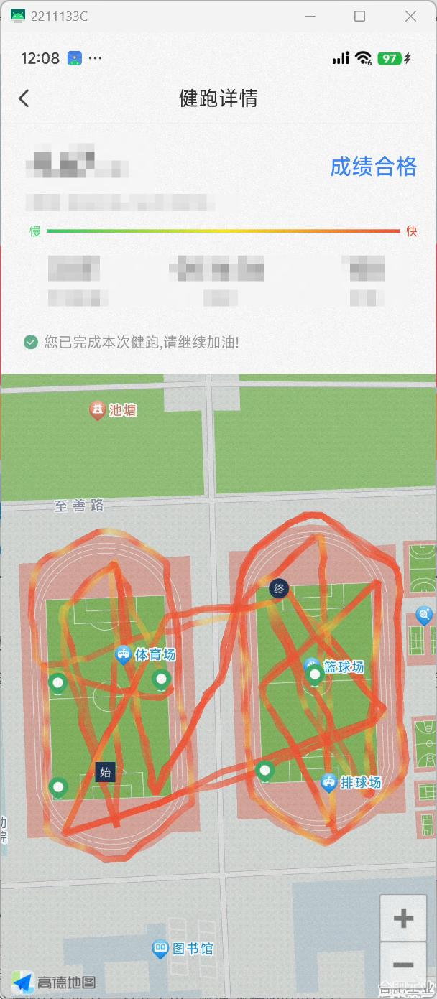

# 一.准备

1.安装好java。本地测试的版本信息为openjdk 17.0.11 2024-04-16 (PS:用openjdk,用oracle解密时会报错)

2.安装好mitmproxy [官网]([mitmproxy - an interactive HTTPS proxy](https://mitmproxy.org/))

# 二.抓包

1.使得手机和电脑处于同一局域网下，可以手机开热点，然后电脑连接手机热点。（windows防火墙记得关）

2.运行脚本

> mitmweb -p 8080 -s proxy.py

3.配置手机代理，这里为了避免一些遇到过的神奇问题，我们使用软件代理的形式

这里我使用到的软件为Super Proxy可在google play下载

在电脑终端输入ipconfig获取到本机本地ip（再次提醒！两个设备要在同一局域网内）

（此时手机大多数应用应该会处于断网状态，无需担心）

4.手机上打开云运动（我是指完整启动这个应用，并非点开后台），此时用户凭证应该都已经保存。

5（可选）.打开你的一次健跑记录，此时本健跑记录会存储在tasks_else文件夹内，可直接用于打表跑步

（记得关闭代理，盲猜会有人忘记关然后惊恐得发现手机上不了网了💦）
